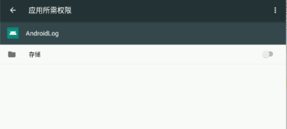

# AndroidLog
## 说明
&emsp;为了方便记录软件运行和出错信息，需要编写日志模块，不仅仅记录java侧的日志，还有jni侧的日志。通过编写好的jni接口将日志传递到jni侧显示并保存下来，jni侧用不同的接口写日志。

java侧写日志的方式
<pre>
String re=u1.get_CSQ();
LogcatSave.instance().log(TAG,"test_csq return is "+re,'d');
</pre>
jni侧写日志的方式
<pre>
log_debug("cloud report data is %s",ask_msg.resp_data);
</pre>

## 注意
由于将日志写入SD卡内，要开启对应的权限。

